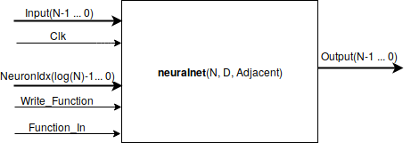

# binary-neuralnet

Generic VHDL entity implementing a clocked, arbitrary graph of lookup tables. 

This represents an artificial neural network with boolean inputs/outputs. 

Each neuron is implemented as a shift register look-up table (SLR) plus a flipflop. Each clock cycle, each neuron computes a new value for its flipflop based on its inputs. The connectivity graph may have cycles (i.e. feedback). 

## Top-Level Entity (lutrons2.vhd)

### Generic Parameters
Name    | Type | Description
---     | ---  | ---       
N       | Integer | Number of neurons 
D       | Integer | 1 + Maximum inputs per neuron (in-degree)
Adjacent | 2D array of Boolean | Adjacency matrix. Adjacent(i,j) <=> Neuron i is an input for neuron j. Must be NxN.

### Ports
Port | Description
 --- | ---
Input(i) | The zeroth input for the i-th neuron
Output(i) | The output of the i-th neuron. Using its lookup table, neuron i computes a boolean function  where , and  are the outputs of the predecessors of neuron i, as defined by Adjacent, sorted by neuron id.
Clk | Clock
Reset | When set to 1, each neuron's output is forced to 0 (synchronous reset).
NeuronIdx | Neuron whose function  should be defined. Integer from 0 to N-1.
Function_In | Bit to push into the lookup table
Write_Function |	When this is 1, at the next rising clock edge, the neuron's lookup table is right-shifted and Function_In is pushed into the highest indexed bit. This allows overwriting the table in 2^D clock cycles. The value  is stored at bit position .

## Files
File | Description
--- | ---
lutrons2.vhd | Contains the main entities neuralnet and neuron	
lutnn2_wrapper.vhd | wrapper (not generic, 32 bit I/O)
topology_XYZ.vhd | graphs used by the wrapper
maketopology.py | python script to generate random topologies for testing
lutnet2_tb.vhd | simulation testbench

## Resource Consumption

Each neuron synthesizes to 1 flipflop and one D-bit SLR. Since the Spartan6 FPGA has 5-bit SLRs, for D>5 multiple SLRs are required per neuron. Space required is linear in N, and for D>5, exponential in D.

The following numbers are for the Spartan6 (XC6SLX45 / CSG324 / -3). A random graph with N nodes and a constant in-degree of D-1 (for all nodes) was used (generated using maketopology.py).

### Shift registers lookup tables (SLR) used
    
|N\D        | 4        | 6         | 7         | 8         |
| ---       | -----    |   ----    |   ----    |   ----    |
|**512**    | 512      |   1024    |	       | 4096      |
|**1024**   |          |   2048    |           |           |
|**1602**   |          |           | 6408      |           |

That is max(N, N * 2^(D-5)).

### Slices used
|N\D        | 4        | 6         | 7         | 8         |
| ---       | -----    |   ----    |   ----    |   ----    |
|**512**    | 1048     |	1335   |	       | 2022      |
|**1024**   |          |   2614    |           |           |
|**1602**   |          |           | 3665      |           |

### Minimum period (ns)
|N\D        | 4        | 6         | 7         | 8         |
| ---       | -----    |   ----    |   ----    |   ----    |
|**512**    | 4.6      |	4.7    |	       | 6.0        |
|**1024**   |          |   7.0     |           |           |
|**1602**   |          |           | 8.6       |           |

### German documentation & Old Version
This was a final project for a first course in VHDL and circuit design at university. 

An different design (more naive, using weights and activation thresholds rather than boolean functions) is available in the old_version folder. 

A more in depth description of both designs, in german, can be found in readme.txt and scaling.txt. 
